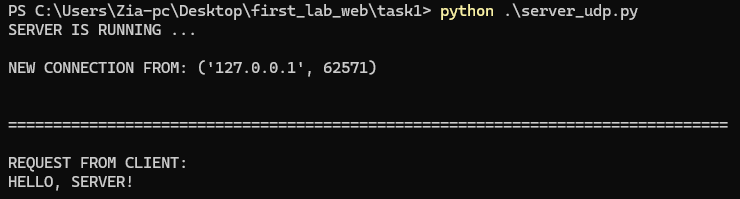
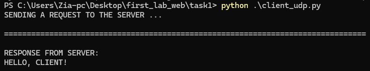

# Задание 1: UDP Клиент-Сервер

## Краткое описание задания

Реализовать клиентскую и серверную часть приложения. Клиент отправляет серверу сообщение «Hello, server», которое должно отображаться на стороне сервера. В ответ сервер отправляет клиенту сообщение «Hello, client», которое отображается у клиента.

## Стек реализации

- Язык: Python
- Библиотека: socket
- Протокол: UDP

## Как запускать

1. Запустите сервер:

   ```
   bash
   python server_udp.py
   ```

2. Запустите клиента:

   ```
      bash
   python client_udp.py
   ```

## server

### server code

```python
import socket

HOST = "127.0.0.1"
PORT = 14900
BUFFER_SIZE = 1024

print("SERVER IS RUNNING ...\n")

conn = socket.socket(socket.AF_INET, socket.SOCK_DGRAM)
conn.bind((HOST, PORT))

request, client_address = conn.recvfrom(BUFFER_SIZE)

print(f"NEW CONNECTION FROM: {client_address}\n")

print("\n" + "=" * 100 + "\n")
print("REQUEST FROM CLIENT: \n" + request.decode() + "\n")

conn.sendto("HELLO, CLIENT!".encode(), client_address)
```

### server output



## client

### client code

```python
import socket

HOST = "127.0.0.1"
PORT = 14900
BUFFER_SIZE = 1024


conn = socket.socket(socket.AF_INET, socket.SOCK_DGRAM)
conn.connect((HOST, PORT))

print("SENDING A REQUEST TO THE SERVER ...")

conn.send(b"HELLO, SERVER!")

response = conn.recv(BUFFER_SIZE).decode()


print("\n" + "=" * 80 + "\n")
print(f"RESPONSE FROM SERVER:\n{response}\n\n")

# conn.close()

```

### Client Output


