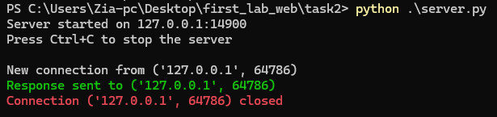

# Задание 2: TCP Клиент-Сервер с математической операцией

## Краткое описание задания

Реализовать клиентскую и серверную часть приложения. Клиент запрашивает выполнение математической операции, параметры которой вводятся с клавиатуры. Сервер обрабатывает данные и возвращает результат клиенту.

Варианты операций:

Теорема Пифагора.
Решение квадратного уравнения.
Поиск площади трапеции.
Поиск площади параллелограмма.

## Стек реализации

- Язык: Python
- Библиотека: socket
- Протокол: TCP

## Как запускать

1. Запустите сервер:
   ```bash
   python server.py
   ```
2. Запустите клиента:
   ```bash
   python client.py
   ```

## server

### server code

```python
import socket
import time

HOST = "127.0.0.1"
PORT = 14900
BUFFER_SIZE = 1024
IPv4 = socket.AF_INET
TCP = socket.SOCK_STREAM


def pythagorean_theorem(operands):
    a, b = operands
    a = float(a)
    b = float(b)
    return str((a * a + b * b) ** 0.5)


def quadratic_equation(operands):
    a, b, c = map(float, operands)
    delta = b * b - 4 * a * c
    if delta < 0:
        return "The equation has no real root."
    elif delta == 0:
        return str(-b / (2 * a))
    else:
        x1 = (-b + delta**0.5) / (2 * a)
        x2 = (-b - delta**0.5) / (2 * a)
        return f"x1 = {x1}\t,\tx2 = {x2}"


def trapezoid(operands):
    a, b, h = map(float, operands)
    s = (a + b) * h / 2
    return str(s)


def parallelogram(operands):
    a, h = map(float, operands)
    return str(a * h)


def handle_request(req):

    operation_str, operands_str = req.split(";", 1)
    operation = int(operation_str)
    operands = operands_str.split(",")

    match operation:
        case 1:
            return pythagorean_theorem(operands)
        case 2:
            return quadratic_equation(operands)
        case 3:
            return trapezoid(operands)
        case 4:
            return parallelogram(operands)


def main():
    server_socket = socket.socket(socket.AF_INET, socket.SOCK_STREAM)
    server_socket.bind((HOST, PORT))
    server_socket.listen(10)
    server_socket.setblocking(False)

    print(f"Server started on {HOST}:{PORT}")
    print("Press Ctrl+C to stop the server\n")

    try:
        while True:

            client_socket = None
            client_address = None

            try:
                client_socket, client_address = server_socket.accept()
                client_socket.setblocking(False)
                print(f"New connection from {client_address}")

                try:
                    data = client_socket.recv(BUFFER_SIZE)
                    if data:
                        response = handle_request(data.decode("utf-8"))
                        client_socket.send(response.encode())
                        print(f"\033[92mResponse sent to {client_address}\033[0m")

                except BlockingIOError:
                    print(f"No data from {client_address}")
                except Exception as e:
                    print(f"Error processing {client_address}: {e}")

                finally:
                    client_socket.close()
                    print(f"\033[91mConnection {client_address} closed\033[0m \n")

            except BlockingIOError:
                time.sleep(0.1)
                continue

            except Exception as e:
                print(f"Error accepting connection: {e}")
                if client_socket:
                    client_socket.close()

    except KeyboardInterrupt:
        print("\nServer is shutting down...")
    finally:
        server_socket.close()
        print("SERVER STOPPED.")


if __name__ == "__main__":
    main()

```

### server output



## client

### client code

```python
import socket
import sys

HOST = "127.0.0.1"
PORT = 14900
BUFFER_SIZE = 1024
IPv4 = socket.AF_INET
TCP = socket.SOCK_STREAM

OPERATIONS = {
    1: "Pythagorean theorem",
    2: "Quadratic equation",
    3: "Area of a trapezoid",
    4: "Area of a parallelogram",
    5: "Exit program",
}


def show_menu():
    print("\n" + "=" * 40)
    print("MATH CALCULATOR CLIENT")
    print("=" * 40)
    for key, value in OPERATIONS.items():
        print(f"{key}. {value}")
    print("=" * 40)


def get_valid_input(prompt, must_be_positive=False):
    while True:
        try:
            value = float(input(prompt))
            if must_be_positive and value <= 0:
                print("\033[91mInput must be greater than zero!\033[0m")
                continue
            return value
        except ValueError:
            print("\033[91mPlease enter a valid number!\033[0m")


def get_user_operation():
    while True:
        show_menu()
        try:
            choice = int(input("Please enter the operation number (1-5):\n> "))
            if 1 <= choice <= 5:
                return choice
            else:
                print("\033[91mPlease enter a number between 1 and 5!\033[0m")
        except ValueError:
            print("\033[91mInvalid input! Please enter a number.\033[0m")


def get_pythagorean_operands():
    print(f"\nYour choice: {OPERATIONS[1]} (a² + b² = c²)")
    a = get_valid_input('Enter value of "a": ', must_be_positive=True)
    b = get_valid_input('Enter value of "b": ', must_be_positive=True)
    return [a, b]


def get_quadratic_operands():
    print(f"\nYour choice: {OPERATIONS[2]} (ax² + bx + c = 0)")
    a = get_valid_input('Enter value of "a": ')
    b = get_valid_input('Enter value of "b": ')
    c = get_valid_input('Enter value of "c": ')
    return [a, b, c]


def get_trapezoid_operands():
    print(f"\nYour choice: {OPERATIONS[3]} (((a + b) × h) / 2)")
    base1 = get_valid_input('Enter length of base "a": ', must_be_positive=True)
    base2 = get_valid_input('Enter length of base "b": ', must_be_positive=True)
    height = get_valid_input('Enter height "h": ', must_be_positive=True)
    return [base1, base2, height]


def get_parallelogram_operands():
    print(f"\nYour choice: {OPERATIONS[4]} (base × height)")
    base = get_valid_input("Enter length of base: ", must_be_positive=True)
    height = get_valid_input("Enter height: ", must_be_positive=True)
    return [base, height]


def get_operands(operation):
    match operation:
        case 1:
            return get_pythagorean_operands()
        case 2:
            return get_quadratic_operands()
        case 3:
            return get_trapezoid_operands()
        case 4:
            return get_parallelogram_operands()
        case 5:
            print("Goodbye!")
            sys.exit(0)


def send_to_server(operation, operands):
    try:
        conn = socket.socket(IPv4, TCP)
        conn.connect((HOST, PORT))

        # Send operation and operands
        data = f"{operation};{','.join(map(str, operands))}"
        conn.send(data.encode())

        # Receive result
        result = conn.recv(BUFFER_SIZE).decode()
        print(f"\nResult: {result}")

    except ConnectionRefusedError:
        print(
            "\033[91mCould not connect to server. Make sure server is running.\033[0m"
        )
    except Exception as e:
        print(f"\033[91mError communicating with server: {e}\033[0m")


def run_client():
    print("Connecting to math calculator server...")

    while True:
        try:
            operation = get_user_operation()
            operands = get_operands(operation)

            if operation != 5:  # Don't send exit command to server
                send_to_server(operation, operands)

                # Ask if user wants to continue
                continue_calc = input(
                    "\nDo you want to continue? (y(by defualt)/n): "
                ).lower()
                if continue_calc not in ["y", "yes", ""]:
                    print("Thank you for using the calculator!")
                    break

        except KeyboardInterrupt:
            print("\n\nInterrupted by user. Goodbye!")
            break
        except Exception as e:
            print(f"\033[91mUnexpected error: {e}\033[0m")


if __name__ == "__main__":
    run_client()


```

### Client Output


