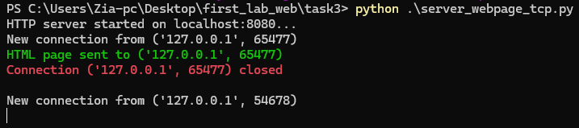
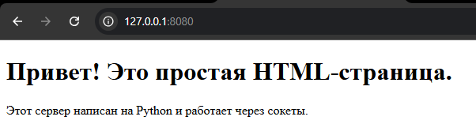

# Задание 3: HTTP Сервер для выдачи HTML страницы

## Краткое описание задания

Реализовать серверную часть приложения, которая отвечает HTTP-сообщением, содержащим HTML-страницу из файла `index.html`.

## Стек реализации

- Язык: Python
- Библиотека: socket
- Протокол: HTTP

## Как запускать

1. Создайте файл `index.html` с содержанием HTML-страницы.
2. Запустите сервер:
   ```bash
   python server_webpage_tcp.py
   ```
3. Откройте браузер и перейдите по адресу:
   ```bash
   http://127.0.0.1:8080/
   ```

## server

### server code

```python
import socket
import time

HOST = "localhost"
PORT = 8080

server_socket = socket.socket(socket.AF_INET, socket.SOCK_STREAM)

server_socket.bind((HOST, PORT))
server_socket.setblocking(False)

server_socket.listen(5)
print(f"HTTP server started on {HOST}:{PORT}...")

try:
    while True:
        try:
            client_connection, client_address = server_socket.accept()
            client_connection.setblocking(False)
            print(f"New connection from {client_address}")

            request = client_connection.recv(1024).decode()
            # print(request)

            f = open(
                "C:/Users/Zia-pc/Desktop/first_lab_web/task3/index.html",
                "r",
                encoding="utf-8",
            )
            html_content = f.read()
            f.close()
            content = html_content.encode("utf-8")
            http_response = (
                "HTTP/1.1 200 OK\r\n"
                "Content-Type: text/html; charset=UTF-8\r\n"
                f"Content-Length: {len(content)}\r\n"
                "Connection: close\r\n"
                "\r\n"
            ).encode("utf-8") + content

            # print("\n", "=" * 100, "\n")
            # print(f"response from server :\n {http_response}\n\n")

            client_connection.send(http_response)
            print(f"\033[92mHTML page sent to {client_address}\033[0m")
            client_connection.close()
            print(f"\033[91mConnection {client_address} closed\033[0m \n")
        except BlockingIOError:
            time.sleep(0.1)
            continue
except KeyboardInterrupt:
    print("\nServer is shutting down...")
finally:
    server_socket.close()
    print("SERVER STOPPED.")

```

### server output



## client

### Client Output


