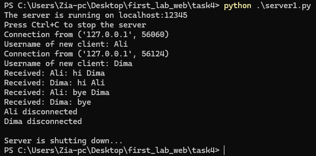
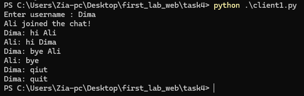
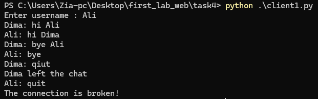

# Задание 4: Многопользовательский чат

## Краткое описание задания

Реализовать многопользовательский чат с использованием потоков для обработки сообщений от разных пользователей.

## Стек реализации

- Язык: Python
- Библиотеки: socket, threading
- Протокол: TCP

## Как запускать

1. Запустите сервер:
   ```bash
   python server1.py
   ```
2. Запустите несколько клиентов в разных терминалах:
   ```bash
   python client1.py
   ```

## server

### server code

```python
import socket
import threading

clients = []
usernames = []
shutdown_event = threading.Event()


def start_server(host="localhost", port=14900):
    server_socket = socket.socket(socket.AF_INET, socket.SOCK_STREAM)
    server_socket.settimeout(1)
    server_socket.bind((host, port))
    server_socket.listen()

    print(f"The server is running on {host}:{port}")
    print("Press Ctrl+C to stop the server")

    try:
        while not shutdown_event.is_set():
            try:
                client_socket, address = server_socket.accept()
                print(f"Connection from {address}")

                client_socket.send("USERNAME".encode("utf-8"))
                username = client_socket.recv(1024).decode("utf-8")

                usernames.append(username)
                clients.append(client_socket)

                print(f"Username of new client: {username}")

                broadcast_message(
                    f"{username} joined the chat!", sender_client=client_socket
                )

                thread = threading.Thread(
                    target=handle_client, args=(client_socket, username)
                )
                thread.daemon = True
                thread.start()
            except socket.timeout:
                continue
    except KeyboardInterrupt:
        print("\nServer is shutting down...")
        shutdown_event.set()

        for client in clients:
            try:
                client.close()
            except:
                pass
        server_socket.close()


def broadcast_message(message, sender_client=None):
    for client in clients:
        if client != sender_client:
            try:
                client.send(message.encode("utf-8"))
            except:
                remove_client(client)


def handle_client(client_socket, username):
    while not shutdown_event.is_set():
        try:
            client_socket.settimeout(1)
            message = client_socket.recv(1024).decode("utf-8")
            if message:
                formatted_message = f"{username}: {message}"
                print(f"Received: {formatted_message}")
                broadcast_message(formatted_message, sender_client=client_socket)
            else:
                remove_client(client_socket)
                break
        except socket.timeout:
            continue
        except:
            remove_client(client_socket)
            break

    try:
        client_socket.close()
    except:
        pass


def remove_client(client_socket):
    if client_socket in clients:
        index = clients.index(client_socket)
        username = usernames[index]

        clients.remove(client_socket)
        usernames.remove(username)

        broadcast_message(f"{username} left the chat")
        client_socket.close()
        print(f"{username} disconnected")


if __name__ == "__main__":
    start_server()


```

### server output



## client

### client code

```python
import socket
import threading
import sys
import time


def receive_messages(client_socket):
    while True:
        try:
            message = client_socket.recv(1024).decode("utf-8")
            print(f"\r{message}\n{username}: ", end="", flush=True)
        except:
            print("\rThe connection is broken!")
            client_socket.close()
            break


def start_client(host="localhost", port=14900):
    global username
    client_socket = socket.socket(socket.AF_INET, socket.SOCK_STREAM)

    try:
        client_socket.connect((host, port))

        username_request = client_socket.recv(1024).decode("utf-8")
        if username_request == "USERNAME":
            username = input("Enter username : ")
            client_socket.send(username.encode("utf-8"))

        receive_thread = threading.Thread(
            target=receive_messages, args=(client_socket,)
        )
        receive_thread.daemon = True
        receive_thread.start()

        while True:
            message = input(f"{username}: ")
            if message.lower() == "quit":
                client_socket.close()
                break
            try:
                client_socket.send(message.encode("utf-8"))
            except:
                print("Error sending the message!")
                break

    except Exception as e:
        print(f"Connection error: {e}")
    finally:
        client_socket.close()


if __name__ == "__main__":
    start_client()

```

### Client Output

client 1:



client 2:


