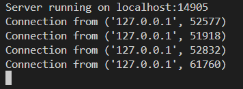

# Задание 5: Web-сервер для обработки GET и POST запросов

## Краткое описание задания

Реализовать веб-сервер, который принимает и записывает информацию о дисциплинах и оценках через POST-запросы и отображает их через GET-запросы.

## Стек реализации

- Язык: Python
- Библиотека: socket
- Протокол: HTTP

## Как запускать

1. Запустите сервер:
   ```bash
   python server1.py
   ```
2. Для добавления данных используйте `curl` или другой HTTP-клиент:

   `curl -d '{"discipline":"Math","mark":"A"}' -H "Content-Type: application/json" -X POST http://127.0.0.1:14905/`

   or

   ```bash
   python client1.py
   ```

3. Для просмотра данных откройте браузер и перейдите по адресу:

```bash
http://127.0.0.1:14905/
```

## server

### server code

```python
import socket
import traceback
import json
import os


class Request:
    def __init__(self, method, target, version, headers, body):
        self.method = method
        self.target = target
        self.version = version
        self.headers = headers
        self.body = body


class Response:
    def __init__(self, status, reason, headers=None, body=None):
        self.status = status
        self.reason = reason
        self.headers = headers or b""
        self.body = body or b""


class MyHTTPServer:
    def __init__(self, host, port, coding="utf-8"):
        self.host = host
        self.port = port
        self.coding = coding
        self.data_file = "task5/server/grades.json"
        self.sock = None  # نگه داشتن socket برای بسته شدن هنگام Ctrl+C

    def serve_forever(self):
        self.sock = socket.socket()
        self.sock.bind((self.host, self.port))
        self.sock.listen(5)
        print(f"Server running on {self.host}:{self.port}")

        try:
            while True:
                conn, addr = self.sock.accept()
                self.serve_client(conn, addr)
        except KeyboardInterrupt:
            print("\nServer interrupted by user. Shutting down...")
        finally:
            if self.sock:
                self.sock.close()

    def serve_client(self, conn, addr):
        print(f"Connection from {addr}")
        conn.settimeout(5)

        try:
            request = self.parse_request(conn)
            response = self.handle_request(request)
        except Exception:
            traceback.print_exc()
            response = Response(400, "Bad Request")
        finally:
            self.send_response(conn, response)
            conn.close()

    def parse_request(self, conn) -> Request:
        data = conn.recv(65535)
        if not data:
            raise ValueError("empty request")

        header_data, _, body_data = data.partition(b"\r\n\r\n")
        header_text = header_data.decode(self.coding, errors="replace")

        lines = header_text.split("\r\n")
        method, url, version = lines[0].split(" ")

        headers = {}
        for line in lines[1:]:
            if line.strip():
                key, value = line.split(":", 1)
                headers[key.strip()] = value.strip()

        body = {}
        if headers.get("Content-Length"):
            content_type = headers.get("Content-Type", "")
            body_text = body_data.decode(self.coding, errors="replace")

            if content_type.startswith("application/json"):
                body = json.loads(body_text)
            elif content_type.startswith("application/x-www-form-urlencoded"):
                body = {}
                for pair in body_text.split("&"):
                    if "=" in pair:
                        key, value = pair.split("=", 1)
                        body[key] = value.replace("+", " ")

        return Request(method, url, version, headers, body)

    def load_data(self):
        if os.path.exists(self.data_file):
            with open(self.data_file, "r", encoding=self.coding) as f:
                return json.load(f)
        return {}

    def save_data(self, data: dict):
        with open(self.data_file, "w", encoding=self.coding) as f:
            json.dump(data, f, ensure_ascii=False, indent=2)

    def handle_request(self, request: Request) -> Response:
        if request.method == "GET":
            with open(
                "task5/server/template_grades.html", "r", encoding=self.coding
            ) as f:
                template = f.read()

            data = self.load_data()
            rows = "".join(
                f"<tr><td>{d}</td><td>{', '.join(m)}</td></tr>\n"
                for d, m in data.items()
            )

            body = template.replace("{{rows}}", rows).encode(self.coding)
            headers = (
                f"Content-Length: {len(body)}\r\n"
                f"Content-Type: text/html; charset={self.coding}\r\n"
            ).encode(self.coding)
            return Response(200, "OK", headers, body)

        elif request.method == "POST":
            discipline = request.body.get("discipline")
            mark = request.body.get("mark")
            if not discipline or not mark:
                return Response(400, "Bad Request")

            data = self.load_data()
            if discipline not in data:
                data[discipline.strip()] = []
            data[discipline].append(str(mark))
            self.save_data(data)

            headers = ("Location: /\r\nContent-Length: 0\r\n").encode(self.coding)
            return Response(303, "See Other", headers, b"")

        else:
            return Response(405, "Method Not Allowed")

    def send_response(self, conn, response: Response):
        res_line = f"HTTP/1.1 {response.status} {response.reason}\r\n"

        headers_text = response.headers.decode(self.coding, errors="ignore")
        if "Content-Length" not in headers_text:
            headers_text += f"Content-Length: {len(response.body)}\r\n"
        if "Content-Type" not in headers_text:
            headers_text += f"Content-Type: text/html; charset={self.coding}\r\n"

        full_response = (res_line + headers_text + "\r\n").encode(
            self.coding
        ) + response.body
        conn.sendall(full_response)


if __name__ == "__main__":
    server = MyHTTPServer("localhost", 14905)
    server.serve_forever()
```

### server output



## client

### client code

```python

import socket
import json

HOST = "localhost"
PORT = 14905
CODING = "utf-8"


def send_post_req(discipline: str, mark: str):
    body = json.dumps({"discipline": discipline, "mark": mark})
    body_bytes = body.encode(CODING)

    request = (
        f"POST / HTTP/1.1\r\n"
        f"Host: {HOST}:{PORT}\r\n"
        f"Content-Type: application/json\r\n"
        f"Content-Length: {len(body_bytes)}\r\n"
        f"Connection: close\r\n"
        f"\r\n"
    ).encode(CODING) + body_bytes

    with socket.socket(socket.AF_INET, socket.SOCK_STREAM) as sock:
        sock.connect((HOST, PORT))
        sock.sendall(request)

        response = sock.recv(4096)

    return response.decode(CODING, errors="replace")


if __name__ == "__main__":
    try:
        while True:
            discipline = input("\nEnter the name of the discipline: ").strip().lower()
            while True:
                try:
                    mark = float(input("Enter the score: ").strip())
                    if not 0 <= mark <= 100:
                        print(
                            "\033[91mInput must be greater than zero and smaller than 100!\033[0m"
                        )
                        continue
                    break
                except ValueError:
                    print("\033[91mPlease enter a valid number!\033[0m")

            resp = send_post_req(discipline, mark)
            print("\nServer response:")
            print(resp.split("\r\n\r\n", 1))

    except KeyboardInterrupt:
        print("\n\nInterrupted by user. Goodbye!")
```

### Client Output

client 1:


client 2:


